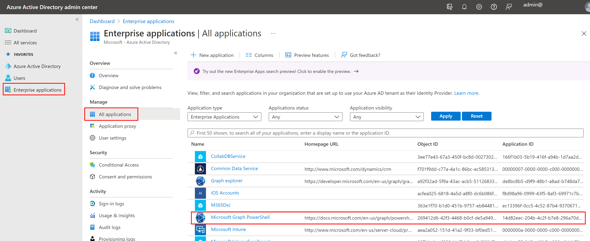

Microsoft365DSC is using several other modules to connect to Microsoft 365, for example the MicrosoftTeams or PnP Powershell modules. Some of the resources are using Microsoft Graph API modules, like the Intune and the (recently converted) Azure Active Directory resources. The idea for Microsoft365DSC is that all modules will be converted to use the Graph API modules as soon as they are available for that workload. This means authentication will be consistent across all workload and at the same time has to follow the authentication possibilities of the Graph API.

## Authentication and permissions

The Graph API has two different authentication implementations:

1. Delegated permissions: Here a username/password is used to authenticate.

    This option is using an AzureAD app in the background to call the Graph API. However the effective permissions will be the intersection of the delegated permissions **and** the user privileges. By default, the Graph app has no permissions meaning it can't access anything and therefore won't work. You have to grant these permissions to the app before using them. Consent for these permissions can be given [by the user himself](https://docs.microsoft.com/en-us/graph/auth-v2-user) or by an admin for all users in the tenant.

    For example: If your account only has permissions on three SharePoint sites, only these sites can be retrieved. Even when the AzureAD app has Sites.FullControll.All permissions granted.

    { align=center width=500 }

    To update the delegated permissions on the Graph app, you can use the "***Update-M365DSCAllowedGraphScopes***" cmdlet and specify the resources you are using. This will read the required permissions for those resources and update those on the Graph app.

    **NOTE:** It is possible to specify your own App registration when using Delegated permissions, but if you don't the generic Graph app is created and used.

2. Application permissions: Here authentication is done using app credentials (either a secret or certificate).

    This option requires [your own app to be registered in Azure AD](https://docs.microsoft.com/en-us/graph/auth-register-app-v2). You can specify what permissions you want your app to have or even create an app for each workloads if necessary. Effective permissions will always be the granted permissions (an user context does not exist). Only [admins can grant these permissions](https://docs.microsoft.com/en-us/graph/auth-v2-service).

    **NOTE:** This is the easiest option to use.

    { align=center width=500 }

**IMPORTANT**: Applications with high privileges should be monitored closely. In practice there are advantages to use conditional access policies for these applications to limit access to specific sources or user accounts.

For more information, check these articles:
- [Authentication and authorization basics for Microsoft Graph](https://docs.microsoft.com/en-us/graph/auth/auth-concepts)
- [Microsoft Graph permissions reference](https://docs.microsoft.com/en-us/graph/permissions-reference)
